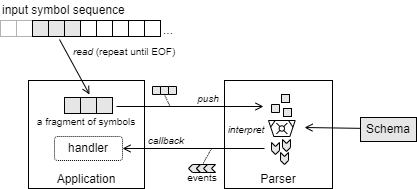
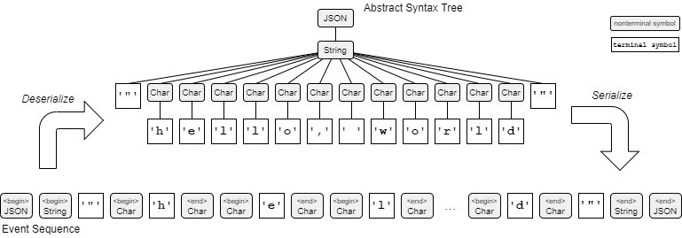
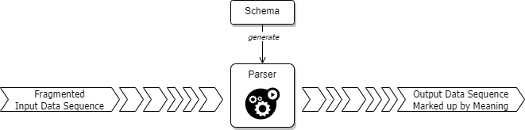

# Terp v0.1 User Guide

## Overview

Terp はストリーム処理やパイプライン処理を目的として設計された Rust 用の構文解析ライブラリです。ストリーム処理向けとは*サイズ制限のないストリーム*から入力される記号列を構文解析できること、パイプライン処理向けとは断片化された記号列を順に入力して*進行した分だけ可能な限りの*構文解析結果を継続的に得られることを意味します。

これはは、一時的にメモリ上に置くことが困難な巨大なデータや TCP/IP 上のプロトコルの解析、REPL のような対話型アプリケーションのインタープリタとして利用できるパーサです。

Terp が伝統的な構文解析器と大きく異なる点は、$k$ 先読み予測やバックトラッキングといった手法ではなく、定義上の選択肢 (alternatives) を並列でマッチングするという点です。これは "記号を1つ入力したらすべての選択肢の状態が1つ進行する" というステートマシンの観点に基づく設計です。v0.x の概念実装では性能が十分ではありませんが、現代的なコンピューティング環境でのマルチコア性能を生かした構文解析が可能になります。

伝統的な構文解析の文脈では、Terp は*再帰降下型の $LL(k)$ パーサ*に相当します。これはストリームの前方から逐次的に解析を行う目的に適してるためです。また LL パーサはストリーム上で構文解析に失敗した位置情報やエラー箇所前後の記号、マッチに失敗した (時に複数の) 構文といった、開発者が問題を発見して修正するための有用な情報を付加しやすくなります。

Terp は BNF や PEG に似た構文定義に基づいて構文解釈を実行します。パーサのソースコードを生成しない代わりに通常の Rust ライブラリとして使用することができます。

## パイプライン化された入出力

Terp は、入力された記号列の分だけ構文解析を進行し、解釈が決定した分だけの結果を構文解析処理からコールバックします。このため入出力をパイプラインで接続する設計にうまく適合することができます。



入力に対して複数の解釈が可能な場合、結果はバッファリングされ、後の入力で決定したときにまとめてコールバックされます。このための入力記号の内部バッファの長さ $k$ がどれだけの大きさになるかは構文定義に依存します。

### ストリーム指向の入力

**入力記号**は入力データのアトミックな (それ以上分割できない) 単位です。例えばテキストを対象とするパーサは一般に `char` 型の入力記号を受け取ります。典型的なパーサにおいて記号は "文字" を意味することが多いですが、Terp はバイト列や `enum` 値の列を対象とした構文解析を行うこともできることから、Terp では解析対象の要素を抽象的に*記号*と呼びます。

Terp ライブラリのソースコードでは単一の入力記号 `Symbol` および入力記号の集合 `Σ` を型パラメータで抽象表現しています。これによりアプリケーションは、一般的な `char` (テキスト) や `u8` (バイナリ) 以外にも、アプリケーションが想定するどのようなデータ型も構文解析の入力記号として使用することができます (例えば塩基配列やトランプのカードの並びを"構文解析"するパーサを定義することもできます)。このような実装はアプリケーションがその入力記号をサポートする `Syntax` を定義したり用意するだけで行えます。

Terp の入力はストリーム指向です。ただし、XML の SAX パーサのように抽象化された "入力ストリーム" から記号列を読み出して構文解析を行うのではなく、アプリケーションがパーサに対して*入力記号列の断片を繰り返し渡す*ことによって行われます。これは、アプリケーションがストリームの読み込みをアプリケーションが代行しているのと同じです。

このような動作はアプリケーションやより上流の都合で構文解析を停止したり、あるいは入力ストリームを介することなくアプリケーションの生成したデータを構文解析することができるという利点があります。したがってパーサに入力ストリームを渡す方法よりも柔軟性の高い設計が可能です。

記号列の断片を入力して、その分だけ内部状態を更新して解析処理を進行するという観点はステートマシンのモデルと同じです。

### マークアップされた入力記号列の出力

アプリケーションはパーサ構築時に指定したコールバック関数を介して構文解析の結果となる抽象構文木 (AST) の断片を受け取ることができます (この動作は一般に push 型パーサと呼ばれます)。コールバック関数に渡される構文木の断片は、データ構造としての木ではなく、解析が進行した分のイベントシーケンスとして表現されています。

データ構造としての木は XML や JSON のようにネストされた "開始" と "終了" でマークアップすることで直列化して表現することができることを思い出して下さい。Terp はデータ構造としての抽象構文木を構築する代わりに、非終端記号の "開始" と "終了" でマークアップされた記号列のイベントを生成します。アプリケーションはこのイベントシーケンスから必要な情報だけを抽出することができます。もちろんこのイベントシーケンスから抽象構文木を構築することも容易でしょう。



このような動作から、Terp は入力記号列を構文定義に従ってマークアップして出力するという動作のパーサと見なすこともできます。

## スキーマ

Terp パーサはアプリケーションの構文定義に基づいて入力文字列をマークアップするように動作します。入力記号列が従うべき構文の定義体を Terp では**スキーマ**と呼びます。スキーマは EBNF のような一般的なメタ言語を元にした書式で、Rust プログラム上で直感的かつ率直な表現で記述することができます。

### スキーマの定義

スキーマは名前付けされた**非終端記号**と対応する `Syntax` 型の構文を関連付けたリストです。まず全体を知るためにスキーマがどのように表現されるかを見てみましょう。例えば JSON の `String` は [RFC 8259 (JSON)](https://datatracker.ietf.org/doc/html/rfc8259#section-7) で次のように定義されています:

```ebnf
string = quotation-mark *char quotation-mark
char = unescaped /
  escape (%x22 / %x5C / %x2F / %x62 / %x66 / %x6E / %x72 / %x74 / %x75 4HEXDIG)
escape = %x5C
quotation-mark = %x22
unescaped = %x20-21 / %x23-5B / %x5D-10FFFF
```

これは Terp のスキーマで次のように表現することができます:

```rust
let schema = Schema::new("JSON")
  .define(String,        id(QuotationMark) & (id(Char) * (0..)) & id(QuotationMark))
  .define(Char,          id(Unescaped) | id(Escape) & (one_of_chars("\"\\/bfnrt") | (ch('u') & (id(HexDig) * 4))))
  .define(Escape,        ch('\\'))
  .define(QuotationMark, ch('\"'))
  .define(Unescaped,     range('\x20'..='\x21') | range('\x23'..='\x5B') | range('\x5D'..='\u{10FFFF}'))
  .define(Digit,         range('0'..='9'))
  .define(HexDig,        range('0'..='9') | range('a'..='f') | range('A'..='F'));
```

この `String` 構文は `QuotationMark`、0 個以上の `Char` の繰り返し、`QuotationMark` という順序の終端記号の結合として定義されています。さらに `QuotationMark` や `Char` は同じスキーマ内にそれぞれ別の構文定義が存在しています。

### `Syntax` 型

Terp では終端記号/非終端記号の区別はあまり重要ではなく、どちらも構文、`Syntax<ID,Σ>` という型で表現されます。ここで `ID` はスキーマで定義する名前付き構文の"名前"の型、また `Σ` はスキーマがサポートする入力記号の型です。

主に `char` と `u8` に対して、`Syntax` を構築するための多くの関数が用意されています。例えば [ch()](../src/schema/chars/mod.rs) は単一の文字 (つまり `char` の終端記号) と一致する `Syntax` を構築し、[range()](../src/schema/matcher/mod.rs) は指定された範囲の文字 (またはバイト値) と一致する `Syntax` を構築します。

| module                  | function                   | input symbol $\Sigma$ |
|:------------------------|:---------------------------|:-------------|
| `terp::schema::matcher` | `id(ID)`                   | `Σ` |
| `terp::schema::matcher` | `id_str(&str)`             | `Σ` |
| `terp::schema::matcher` | `range(RangeInclusion<Σ>)` | `Σ` |
| `terp::schema::matcher` | `seq(&[Σ])`                | `Σ` |
| `terp::schema::matcher` | `one_of(&[Σ])`             | `Σ` |
| `terp::schema::matcher` | `one_of_seqs(&[Vec<Σ>])`   | `Σ` |
| `terp::schema::chars`   | `ch(char)`                 | `char` |
| `terp::schema::chars`   | `token(&str)`              | `char` |
| `terp::schema::chars`   | `one_of_tokens(&[&str])`   | `char` |

これらの規定の関数以外にも入力記号列との一致判定を実装することで `Syntax` を簡単に作成することができます。例えば以下の例はアプリケーションが実装した「ASCII 大文字」の 1 文字と一致するマッチ関数を使って `Syntax` を構築しています (大文字という特性は文字に特有の属性であるため `Σ` は `char` となります)。

```rust
fn upper_case<ID>() -> Syntax<ID, char> {
  Syntax::from_fn("UPPER", |values: &[Σ]| -> Result<Σ, MatchResult> {
    if values.is_empty() {
      // This call didn't match but may match in a future decision.
      Ok(MatchResult::UnmatchAndCanAcceptMore)
    } else if values[0].is_ascii_uppercase() {
      // The first 1-character of the input symbols matched this syntax.
      Ok(MatchResult::Match(1))
    } else {
      // It has been determined that the input symbols don't match this syntax.
      Ok(MatchResult::Unmatch)
    }
  })
}
```

一般的に、後述する結合や選択を使って複雑な `Syntax` を構築するよりも、このようなマッチ関数を使って構築された `Syntax` の方が良好なパフォーマンスで動作します。どのような方法で構文を定義するかは、定義の可視性、パフォーマンス、再利用性などを考慮して選択することができます。

### 量指定子

各 `Syntax` は出現回数の最小値と最大値を持っています。この文書では構文 `X` が最低 `n` 回、最大 `m` 回出現しなければならないことを正規表現風の量指定子を使用して `X{n,m}` と表記します。そして量指定子を省略した構文は暗黙的に最低 1 回、最大 1 回の繰り返しであることを意味しています。

Terp では量指定子を `Range` または `RangeInclusion` で表現し、`Syntax` との**乗算演算子**を用いて出現回数を定義した構文を生成します。

| Notation | Canonical | Syntax Definition |
|:------|:-----|:------|
| `X`  | `X{1,1}` | `X` |
| `X?` | `X{0,1}` | `X * (0..=1)` |
| `X*` | `X{0,usize::MAX}`  | `X * (0..)` |
| `X+` | `X{1,usize::MAX}`  | `X * (1..)` |
| `X{n,m}` | `X{n,m}` | `X * (n..=m)` |

Terp では量指定子で指定できる最大値 (または上限未指定) は `usize::MAX` と等価です。また実際の入力記号列で繰り返し出現可能な上限も `usize::MAX` までです。

以下の例は 0 回以上 1 回以下の `'X'` の繰り返しを表す `Syntax` を生成します。

```rust
ch('X') * 5         // matches "XXXXX"
ch('Y') * (0..=1)   // matches "" or "Y"
```

### 結合演算子と選択演算子

`Syntax` は**結合演算子** `&` (concat, sequence) を使用して構文の連続を表すことができます。例えば `A & B` は構文 `A` の後に構文 `B` が続くことを意味します。

同様に**選択演算子** `|` (or, alternatives) は左右オペランドのいずれかの選択を表します。例えば `A | B` は構文 `A` または構文 `B` のどちらかと一致します。もし複数の構文と一致する場合、**最長一致規則**に従い一致した記号列の長い方が採用されます。一致した記号列の長さも等しい場合、構文解析は「`A` と `B` の二つの解釈がある」という非決定性を持つためエラーとなります。

どちらの演算子も結果は `Syntax` 型となるため連続して適用することができます。次の式はトランプのスートのいずれかと一致する `Syntax` を生成します。

```rust
ch('t') & ch('e') & ch('r') | ch('p')   // matches a character sequence "terp"
ch('♠') | ch('♣') | ch('♦') | ch('♥')   // matches one of the suits of cards.
```

Terp の構文の表現は Rust の文法に従うことから、量指定子、結合、選択の表現は括弧 `(...)` を使って優先順位を指定することができます。

### 名前付き構文と再帰構文

構文 `Syntax` は最終的に名前と関連付けられてリスト化されスキーマ `Schema` を構成します。構文に関連付けられた名前は単に BNF に似せた表記のためだけではなく、入力記号列をマークアップするための "タグ" として使用されます。

構文式には同じスキーマ内で定義されている構文定義を使用することができます。次の例では、構文 `CARD` は `"♥A"`, `"♠Q"`, `"♣2"` といった文字列と一致します。

```rust
Schema::new("Trump")
    .define("CARD", id("SUIT") & id("RANK"))
    .define("SUIT", one_of_chars("♠♣♦♥"))
    .define("RANK", one_of_chars("A233456789XJQK"));
```

また自身を直接的または間接的に参照する再帰的な構文を定義することもできます。次の例では構文 `P` が再帰的に自身を参照していることから、`P` は `"terp"`, `"(terp)"`, `"((terp))"`, `"(((terp)))"`, ... といった文字列と一致することができます。

```rust
// P = ("(", P, ")") | "terp"
Schema::new("Foo")
  .define("P", (ch('(') & id("P") & ch(')')) | token("terp"));
```

## パーサの動作

Terp パーサはスキーマの構文定義に従って入力記号列を解析し、定義された名前でマークアップした結果を出力します。アプリケーションはコールバック関数を指定することでこの構文解析結果を受け取ることができます。



では実際にトランプのカードを識別するスキーマを使用して入力記号列 `"♠2"` の構文解析を行ってみましょう。次の Terp コードはマークアップされた入力記号列のイベントを解析結果として `Vec` 保存します。

```rust
use terp::parser::{Context, Event, EventKind};
use terp::schema::chars::{one_of_chars, Location};
use terp::schema::{id, Schema};

let schema = Schema::new("Trump")
  .define("CARD", id("SUIT") & id("RANK"))
  .define("SUIT", one_of_chars("♠♣♦♥"))
  .define("RANK", one_of_chars("A233456789XJQK"));

let mut events = Vec::new();
let handler = |e: Event<_, _>| events.push(e);
let mut parser = Context::new(&schema, "CARD", handler).unwrap();
parser.push_str("♠2").unwrap();
parser.finish().unwrap();

assert_eq!(
  vec![
    Event { location: Location { chars: 0, lines: 0, columns: 0 }, kind: EventKind::Begin("CARD") },
    Event { location: Location { chars: 0, lines: 0, columns: 0 }, kind: EventKind::Begin("SUIT") },
    Event { location: Location { chars: 0, lines: 0, columns: 0 }, kind: EventKind::Fragments(vec!['♠']) },
    Event { location: Location { chars: 1, lines: 0, columns: 1 }, kind: EventKind::End("SUIT") },
    Event { location: Location { chars: 1, lines: 0, columns: 1 }, kind: EventKind::Begin("RANK") },
    Event { location: Location { chars: 1, lines: 0, columns: 1 }, kind: EventKind::Fragments(vec!['2']) },
    Event { location: Location { chars: 2, lines: 0, columns: 2 }, kind: EventKind::End("RANK") },
    Event { location: Location { chars: 2, lines: 0, columns: 2 }, kind: EventKind::End("CARD") },
  ],
  events
);
```

パーサはスキーマ、スキーマに定義されている初期非終端記号、解析結果を受け取るコールバック関数を指定して `Context::new()` で構築します。

この例では一度の `push_str()` 呼び出しですべての入力記号列を解析していますが、これは複数回の呼び出しに分けても同じ結果を得ることができます。

```rust
parser.push_str("♠").unwrap();
parser.push_str("2").unwrap();
parser.finish().unwrap();
```

入力記号列をすべて渡し終わった後の `finish()` は必須です。この呼び出しにより、入力待ち状態になっていた残りのすべての解析ステップが確定し、バッファリングされていたすべてのイベントが `handler` 関数に通知されます。

### イベントの逐次性

パーサの解析処理は `push()` や `push_str()` が呼び出されるたびに進行し、その時点で確定したイベントから順次通知されます。例として前述のトランプ識別パーサのイベントハンドラが入力に対してどのように通知を受けるかを調べてみましょう。

```rust
let handler = |e: Event<_, _>| println!("{:?}", e.kind);
let mut parser = Context::new(&schema, "CARD", handler).unwrap();
println!("-- pushing ♠ --");
parser.push_str("♠").unwrap();
println!("-- pushing 2 --");
parser.push_str("2").unwrap();
println!("-- finishing --");
parser.finish().unwrap();
```

このコードから次のような出力が得られます。

```
-- pushing ♠ --
Begin("CARD")
Begin("SUIT")
Fragments(['♠'])
End("SUIT")
Begin("RANK")
-- pushing 2 --
Fragments(['2'])
-- finishing --
End("RANK")
End("CARD")
```

パーサは 1 つの記号を認識すると次の終端記号の定義まで移動して待機します。上記の例では `♠` とマッチした後に `RANK` 定義まで移動します。もし `♠` に続いて `$` が入力された場合は「`RANK` を期待したが `$` が現れた」という構文エラーが発生するでしょう。

定義の終わりに達していて次の終端文字がない場合は現在の位置で停止し `finish()` を待機します。上記の例では `2` とマッチした後は次の構文が存在しないためその位置で停止し、`finish()` が呼び出されたときに `RANK` と `CARD` を終了させます。この動作により、`2` に続いて `3` が入力されたとき「`RANK` に続いて EOF を期待したが `3` が現れた」という構文エラー

コールバック関数はエラーを返すことができません。アプリケーションで構文構造上のエラーを検知したときは `push_str()` の呼び出しを停止するようにする必要があります<sup>[NEED TO CHANGE]</sup>。

## Dive Inside Terp

The following pages provide useful information for developers and source code readers.

* [Inside Terp v0.1](inside-v0.1.md)
