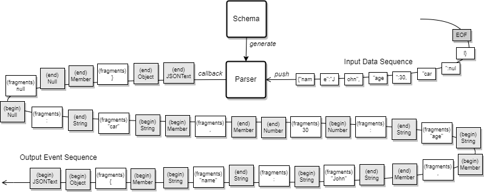
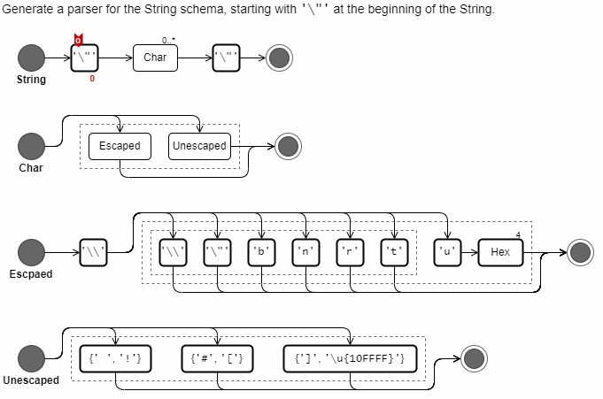
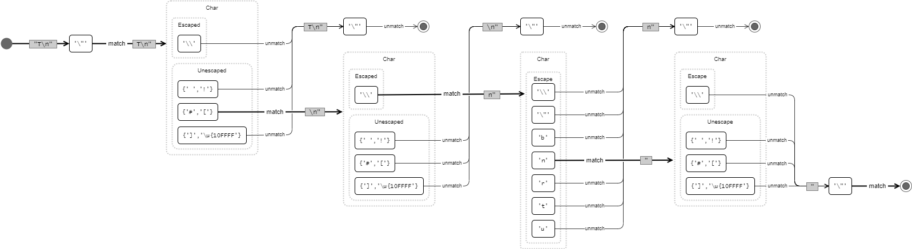
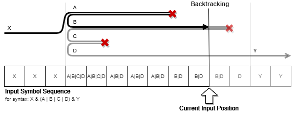
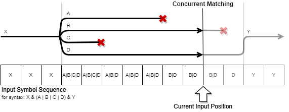
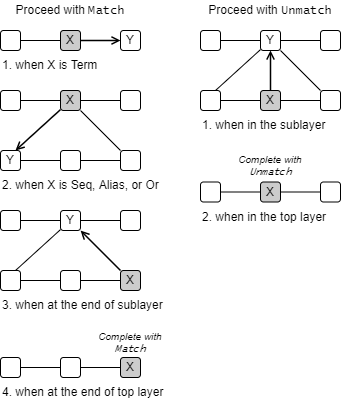

# Inside Terp v0.1

This page describes an internal design and implementation of [terp](https://github.com/torao/terp) v0.1, parser generator library.

## Overview

Terp は Rust プログラミングで利用できる構文解析用のライブラリである (パーサのソースコードは生成しないためパーサジェネレータではない)。Terp の目的はユーザが定義したスキーマに従った入力記号列の解析結果をアプリケーションで利用できるようにすることである。

Terp の基本的な動作は、断片化された記号列の逐次的な入力で内部状態を更新し、その結果が決定状態であればその位置までの解析結果をイベントとしてアプリケーションに通知する。

### Symbol

**入力記号**は入力データのアトミックな (それ以上分割できない) 単位である。例えばテキストデータを対象とするパーサは一般に `char` 型の入力記号を受け取る。Terp ライブラリのソースコードでは単一の入力記号 `Symbol` および入力記号の集合 `Σ` を型パラメータで抽象化して表現し、`char` (テキスト) や `u8` (バイナリ) 以外の種類の入力記号列でも構文解析を使用することができる。パーサがどのような入力記号を受容するかは、パーサを生成する `Schema` や `Syntax` のサポートする入力記号に依存する。



### Alternatives

terp での選択肢は OR 演算子を用いて表現される。そしてバックトラッキングではなく、並行する評価状態を維持して判断を行う。

OR 構文で複数の選択肢と一致している場合、一般に最も長い一致が採用される考え方が強い。例えば `("as" | "async") & .*` に対する `"async"` の入力は `["as","ync"]` ではなく `["async",""]` と評価される。

OR 選択肢は並行して評価しなければならない。
もし逐次で行う場合、1 つ目の判定が確定した後に 2 つ目を判定する動作となる。
これは、1 つ目の判定が確定するまでのすべての入力を 2 つ目の判定のために保持しておかなければならないことを意味しており、例えば 10GB の後に確定するような入力を与える攻撃に脆弱となる。
幅優先に似た進行をしなければならない。

このため OR の出現によって同時に複数の経路が発生しそれぞれが個別の状態を持つ。
複数の経路はマルチスレッドで並列処理できる一方で、その出現はパーサの処理効率を低下させることは明らかで、`one_of()` や独自の Matcher 実装などを使用して OR の出現を減らすことが効率的なスキーマ定義となる。

## Parser Algorithm

terp はトップダウン型、LL 型の再帰降下パーサに分類される。

terp パーサは入力データシーケンスに対して内部状態を更新しながらスキーマを走査してマークアップを行う。例として以下のような C/C++ や Java に似た文字列リテラルのスキーマを想定する。

```ebnf
String    := '\"' & Char* & '\"';
Char      := Escaped | Unescaped;
Escaped   := '\\' & (('\\' | '\"' | 'b' | 'n' | 'r' | 't') | ('u' & Hex{4}));
Unescaped := {' ','!'} | {'#','[']} | {']','\u{10FFFF}'};
```

このスキーマに従う terp パーサは `"T\n"` という 5 文字の入力に対して以下のように進行する (赤で示した記号はパーサの状態の一部)。

[](automaton-string.gif)<br/>
Fig X.

Matcher が Unmatch と判定しても現在位置や上位層の構文の判定で Match とみなされることがある点に注意。これは Matcher の判定に加えて繰り返し条件を判定するためである。Unmatch 判定は最上位に到達した後で確定する。

上記の例での最後の `'\"'` 入力は Escaped も Unescaped も Unmatch 判定だが、Char の繰り返し条件 `0..*` を満たしていることから String 層で Match に転換されて次の `'\"'` 判定に移ることができる。以下は上記の例の Unmatch 経路を省略していない図である。

[](automaton-string.png)<br/>
Fig X. 文字列リテラルの解析で発生するすべての評価経路。

OR を経由するとパーサの経路が複数に分岐する。

パーサは、未入力の初期状態で String スキーマの先頭である Term(`'\"'`) を指している。

マージは今後の課題である。

### Concurrent Matching

よくあるパーサ実装は $k$ 個の先読みによる予測、またはバックトラッキングを用いてどの選択肢が正しい経路かを判断する。

<br/>
Fig X. バックトラッキング型パーサの評価経路。

バックトラッキングは逐次入力で進行する場合は停止しなければならない。また複数の選択肢と一致するケースを考慮して、一致する選択肢を見つけたとしてもすべての選択肢を試さなければならない。PEG ではこのような無駄を回避するために最初に一致した選択肢で決定する短絡評価選択が導入されている。

一方、Terp は選択肢ごとに評価経路を分岐し、並列して経路の正しさを評価する。

<br/>
Fig X. Terp の評価経路。選択肢ごとに分岐した経路のそれぞれが並行するサブパーサとして機能する。

Fig X では現在の入力位置で B と D の経路が候補として残っていることを示している。このように、解析のある時点で複数の経路が残っている状態を**非決定状態**と呼び、ただ一つの経路のみが残っている状態 (成功) または一つも経路が残っていない状態 (失敗) を**決定状態**と呼ぶ。決定状態にある解析処理は残存している経路が (もしあれば) 生成したすべてのイベントをフラッシュし、イベント通知の完了した位置までバッファの先頭を削除することができる。

### Proceeding a Step

入力に対して現在の位置の構文ノードでの出現回数が繰り返し回数の上限に達していない場合、その構文ノードの状態は*評価可能*である。
入力に対して現在の位置の構文ノードが Match であり、出現回数が繰り返し回数の上限に達している場合、その構文ノードの状態は*進行可能*である。

現在位置の構文ノードが進行可能である場合、次の構文ノードに移動する。
Match で移動する場合、
現在の構文で Match あるは Unmatch の判定を伴う進行はイカのようになる。

[](proceed.png)<br/>
Fig X.

### EOF の到達

入力が EOF (終端) に達したとき、パーサはまだ未確定の状態のことがある。例えば 3 文字以上の数字の繰り返し `{'0','9'}{3,*}` に対して `012` の入力があった場合、パーサは `2` に続く文字がある可能性を考慮して判定を確定できないままでいる。このため EOF に到達したことを示すために finish() という操作が存在し、その中では繰り返し条件によって未確定になっている経路の現在の繰り返し数が繰り返し条件を満たしているかの判定を強制してスキーマの終端まで強制的に到達させることで結果を確定させる。

ある経路が Completed 状態であるにもかかわらず次のアイテムが入力された場合、その経路は EOF を期待したが余分な後続データが存在したことを意味するため Unmatch で確定する。

EOF 処理では Matcher の `MatchResult::MatchAndCanAcceptMore` は Match、`MatchResult::UnmatchAndCanAcceptMore` は Unmatch とみなされる。

### イベント

経路ごとに保存されているイベントはその経路での「解釈」を考えることができる。2 つの異なる経路が同一のイベントシーケンスを保留している場合、それらの経路は同じ解釈をしていると考えてよい。

一般に、名前がつけられた Syntax のすべてを通知対象とすると (一文字ごとにマークアップされるように) 詳細すぎるため、無視するイベントを指定する。
